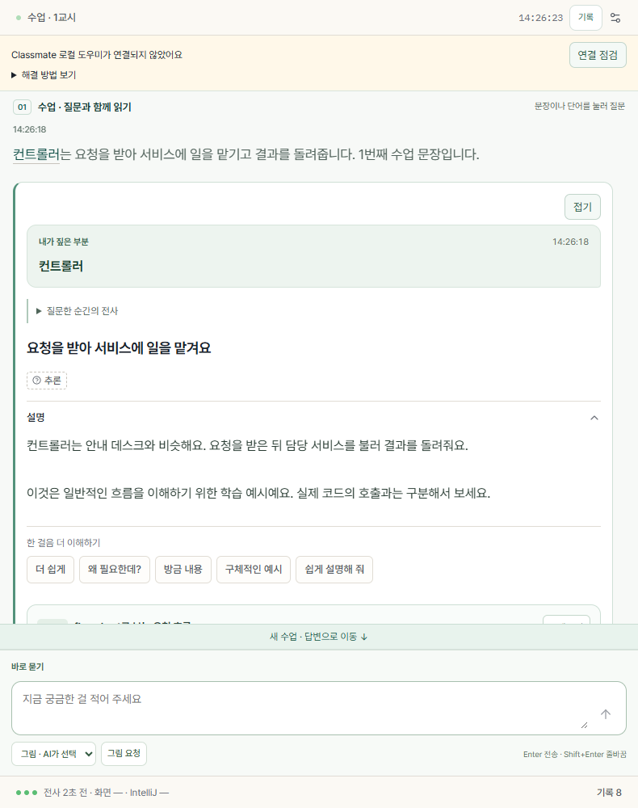
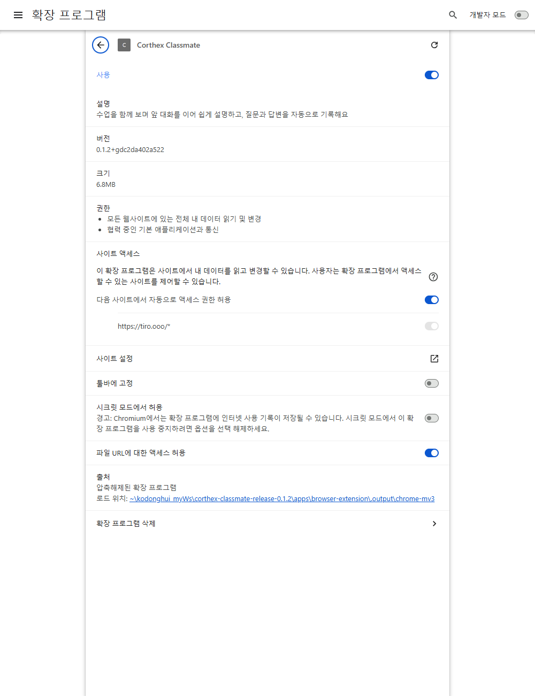
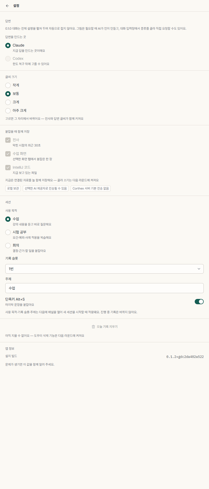
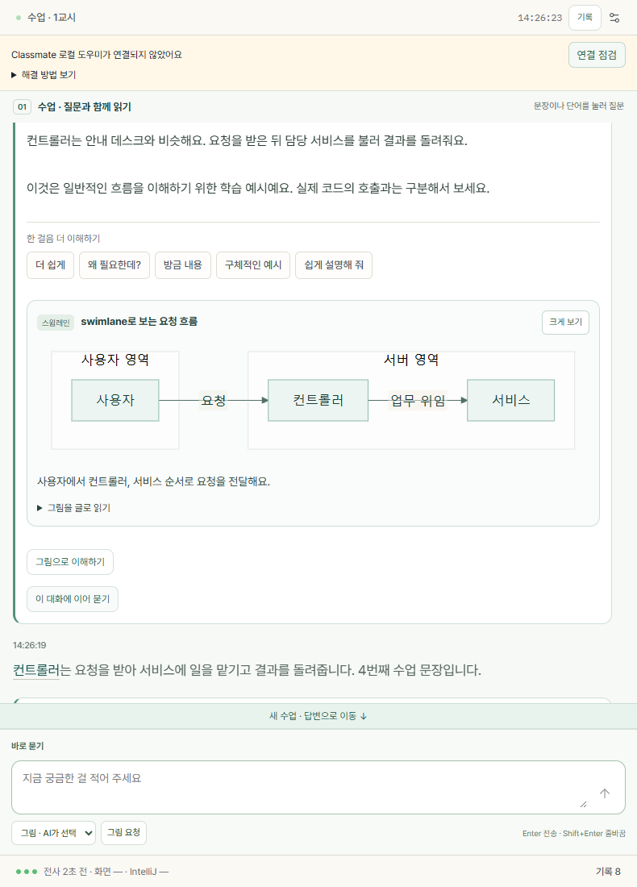

# Corthex Classmate

**수업과 회의를 들으면서, 모르는 순간 바로 묻고 함께 이해하는 AI 동반자.**

Tiro가 말을 글로 바꾸면, Classmate는 Chrome 오른쪽에서 그 전사와 선택한 화면을 참고해 설명합니다. 코딩 수업뿐 아니라 현장 강의, 시험 공부, 온라인·대면 회의에도 사용할 수 있습니다.

**[Windows 0.1.2 설치 ZIP 받기](https://github.com/kodonghui/classmate/releases/download/v0.1.2/Corthex-Classmate-0.1.2-windows-x64.zip)** · **[버전별 다운로드](https://github.com/kodonghui/classmate/releases)** · **[문제 제보](https://github.com/kodonghui/classmate/issues)**

> 현재 배포판: **0.1.2 · Windows x64 · Chrome · Claude Code**
>
> 휴대폰은 **Tiro 녹음기**로 사용할 수 있습니다. Classmate 자체는 **PC Chrome 확장**이며 휴대폰 전용 앱은 아닙니다.
>
> Codex 연결, 자동 블로그 발행, 항상 최신 정보를 검증하는 웹 검색은 현재 제공하지 않습니다.



*설명서의 Classmate 화면은 실제 프로그램을 Chromium에서 실행해 촬영했습니다. 개인정보 보호를 위해 수업·답변은 합성 예제입니다. 실제 Claude 답변 품질을 입증하는 캡처는 아닙니다.*

## 처음이라면 이 순서만 따라 하세요

1. **내 PC에 Claude Code 설치·로그인** → 아래 **Windows 0.1.2 ZIP** 설치 → Chrome에 확장을 추가합니다. 자세한 경로는 [설치하기](#3-classmate-설치하기)를 참고하세요.
2. **PC 영상·온라인 회의**는 Tiro 데스크톱의 시스템 사운드로, **현장 강의·대면 회의**는 휴대폰 Tiro의 실시간 모드로 녹음합니다.
3. Tiro 노트에서 **공유 → 링크 복사**를 하고, **Classmate를 설치한 PC Chrome 주소창**에 붙여넣습니다. 실제 전사가 보이는 탭을 열어 둡니다.
4. 참고할 **영상·Meet·자료 탭**으로 가서 **Classmate 아이콘**을 누릅니다. 현장 음성만 있다면 Tiro 공유 탭에서 열어도 됩니다.
5. 패널 설정에서 **사용 목적·기록 슬롯·주제**를 정하고 패널을 다시 엽니다. 전사 문장을 누르거나 하단에 질문하면 **그 문단 바로 아래에 답변**이 나타납니다.

**이미 설치되어 있다면 재설치부터 하지 말고 [업데이트 방법](#13-업데이트와-연결-해제)을 먼저 확인하세요.** 새로고침은 이미 교체된 파일을 다시 읽는 동작이며, 새 버전을 다운로드하는 기능이 아닙니다.

## 목차

1. [어떤 상황에 쓸 수 있나요?](#1-어떤-상황에-쓸-수-있나요)
2. [처음 한 번 준비하기](#2-처음-한-번-준비하기)
3. [Classmate 설치하기](#3-classmate-설치하기)
4. [Tiro에서 녹음 시작하기](#4-tiro에서-녹음-시작하기)
5. [공유 링크를 Chrome에 연결하기](#5-공유-링크를-chrome에-연결하기)
6. [설정과 첫 질문](#6-설정과-첫-질문)
7. [수업 중 사용하는 방법](#7-수업-중-사용하는-방법)
8. [그림으로 이해하기](#8-그림으로-이해하기)
9. [질문할 때 AI가 받는 자료](#9-질문할-때-ai가-받는-자료)
10. [기록과 복습](#10-기록과-복습)
11. [활용 예시](#11-활용-예시)
12. [문제 해결](#12-문제-해결)
13. [업데이트와 연결 해제](#13-업데이트와-연결-해제)
14. [개인정보·비용·지원 범위](#14-개인정보비용지원-범위)

## 1. 어떤 상황에 쓸 수 있나요?

| 상황 | 소리는 어디서 받나요? | PC에서는 무엇을 열까요? |
|---|---|---|
| Google Meet 온라인 회의 | Tiro **데스크톱 앱의 시스템 사운드**, 내 발언도 필요하면 마이크 | Tiro 공유 전사 탭 + Meet 탭 |
| Drive·YouTube·인터넷 강의 | Tiro **데스크톱 앱의 시스템 사운드** | Tiro 공유 전사 탭 + 영상 탭 |
| 오프라인 강의·대면 회의 | **휴대폰 Tiro 마이크**, 실시간 녹음 | PC Chrome의 Tiro 공유 전사 탭, 있으면 강의 자료 탭 |
| Meet에는 화면만 나오고 강사 목소리는 현장에서 들림 | **휴대폰 Tiro 마이크** | Tiro 공유 전사 탭 + Meet 화면 탭 |
| 녹음이 끝난 수업 복습 | Tiro에 이미 생성된 전사 | Tiro 공유 전사 탭, 필요하면 해당 자료 탭 |

**화면과 소리는 서로 다른 경로입니다.** Meet에 강사의 소리가 없어도, 휴대폰으로 현장 목소리를 전사하면서 PC의 Meet 화면을 참고하게 할 수 있습니다.

```text
A. PC 영상·회의 소리 ── Tiro 데스크톱 ──┐
                                      ├─ Tiro 공유 전사 페이지 ── Classmate 전사와 문답
B. 현장 목소리 ────── 휴대폰 Tiro ─────┘
선택한 PC Chrome 화면 ── 질문할 때 캡처 시도 ──┐
전사 + 내 질문 + 최근 문답 ─────────────────────┼─ 내 PC Claude Code ── 설명·그림
                                               └─ 로컬 기록
```

화면 자료가 없으면 전사를 중심으로 질문하세요. Classmate가 휴대폰 카메라나 실제 교실 칠판을 자동으로 보는 것은 아닙니다. 관련 자료를 PC Chrome에 열어 선택해야 그 화면을 참고할 수 있습니다.

## 2. 처음 한 번 준비하기

### 준비물

- **Windows x64 PC와 Chrome**: 이 설치 묶음은 Mac·휴대폰용이 아닙니다.
- **본인 Tiro 계정과 앱**: [Tiro 공식 사이트](https://tiro.ooo)에서 데스크톱 또는 모바일 앱을 설치합니다.
- **같은 PC에 설치하고 로그인한 Claude Code CLI**: 아래 설명을 확인하세요.
- 인터넷 연결: 실시간 Tiro 전사와 Claude 응답에 필요합니다.
- 강의·회의를 녹음하고 AI에 활용할 수 있는 권한 또는 동의.

### Claude 준비 — 일반 Claude 앱과 구분하세요

**Claude 웹사이트나 일반 데스크톱 앱에 로그인한 것만으로는 부족합니다.** Classmate는 Windows에서 실행할 수 있는 **Claude Code CLI**를 사용합니다.

1. [Claude Code 공식 설치 안내](https://code.claude.com/docs/en/quickstart)를 엽니다.
2. Windows 설치 방법에 따라 **이 PC의 Windows 환경**에 설치합니다. WSL 안에만 설치한 것은 이 배포판에서 지원하지 않습니다.
3. 시작 메뉴에서 **PowerShell**을 열고 `claude auth login`을 입력합니다.
4. 화면에 나오는 로그인 절차를 **본인 계정**으로 완료합니다.
5. `claude auth status --text`로 로그인 상태를 확인합니다. 상태 확인은 AI 답변 생성이 아닙니다.
6. Classmate 설치 후 패널 상단의 **연결 점검**이 로그인 확인으로 바뀌는지 보고, 마지막으로 짧은 질문 한 번을 보내 답변을 확인합니다. 이 질문에는 본인 AI 사용량이 적용됩니다.

Classmate 설치기는 일반적인 Windows Claude Code 경로를 자동으로 찾습니다. **다른 사람 계정을 가져오거나, 다른 물리적 PC에 있는 Claude에 자동 접속하지 않습니다.** 필요한 Claude 실행 환경은 공식 안내를 따르세요. Classmate 자체를 쓰기 위해 소스를 빌드하거나 개발용 Node·Rust를 설치할 필요는 없습니다.

Claude와 Tiro의 요금제·한도는 별개입니다. Classmate가 구독 제한을 없애 주지는 않습니다. 특히 `ANTHROPIC_API_KEY`를 설정한 환경의 비대화형 요청은 API 인증이 우선될 수 있습니다. Classmate는 계정·토큰을 복사하거나 자체 Claude OAuth 로그인을 제공하지 않고, 사용자가 공식 Claude Code에 직접 로그인한 로컬 실행 환경을 사용합니다.

## 3. Classmate 설치하기

### 3-1. ZIP 전체를 받습니다

1. 위의 **Windows 0.1.2 설치 ZIP 받기**를 누릅니다.
2. 파일 이름이 `Corthex-Classmate-0.1.2-windows-x64.zip`인지 확인합니다.
3. 탐색기에서 ZIP을 우클릭 → **모두 압축 풀기**를 선택합니다.
4. 풀린 폴더 안에 `Install.cmd`, `Guide.html`, `app` 폴더가 있는지 확인합니다.

**GitHub의 초록색 Code → Download ZIP은 프로그램 설치 파일이 아닙니다.** 릴리스의 프로그램 ZIP을 받으세요. ZIP 안에서 곧바로 실행하지 말고 먼저 전체 압축을 푸세요.

### 3-2. 로컬 도우미를 설치합니다

1. 압축을 푼 폴더의 **Install.cmd**를 더블클릭합니다.
2. 설치가 끝나면 나타나는 안내와 **확장 폴더 경로**를 확인합니다.
3. 오류가 나오면 창을 닫기 전에 오류 문구를 확인하세요. 기존 설치가 있다고 나오면 [업데이트 안내](#13-업데이트와-연결-해제)로 이동합니다.

기본 확장 설치 위치는 다음과 같습니다.

```text
%LOCALAPPDATA%\Programs\CorthexClassmate\0.1.2\app\extension
```

`%LOCALAPPDATA%`는 내 Windows 사용자의 프로그램 폴더를 뜻합니다. 위 경로를 탐색기 주소창에 붙여넣으면 실제 폴더로 이동할 수 있습니다. **설치 완료 화면이 다른 경로를 알려 주었다면 그 경로가 우선입니다.**

관리자 권한은 요구하지 않습니다. 서명되지 않은 초기 배포판이므로 보안 경고가 나올 수 있습니다. 출처를 확인하고, 백신이나 회사·학교 보안 정책을 끄지 마세요. 정책상 차단되면 관리자 또는 배포자에게 문의하세요.

### 3-3. Chrome에 확장을 추가합니다

1. 작업을 저장하고 Chrome을 완전히 종료한 뒤 다시 엽니다.
2. 주소창에 `chrome://extensions`를 입력합니다. 검색창이 아니라 **주소창**입니다.
3. 오른쪽 위 **개발자 모드**를 켭니다.
4. **압축해제된 확장 프로그램을 로드합니다**를 누릅니다. Chrome 언어·버전에 따라 표현이 조금 다를 수 있습니다.
5. 설치 완료 화면에서 알려 준 **app → extension 폴더**를 선택합니다. ZIP 파일, app 폴더 자체, host 폴더를 선택하면 안 됩니다.
6. **Corthex Classmate**, 버전 **0.1.2**, 사용 스위치 켜짐을 확인합니다.
7. Chrome 오른쪽 위 퍼즐 모양 **확장 프로그램** 메뉴에서 Corthex Classmate의 **핀**을 눌러 고정합니다.



*위 화면은 실제 확장 관리 화면입니다. 안내용 시험 환경이라 경로·빌드 식별자는 내 PC와 다를 수 있습니다.*

**설치 완료 기준:** Chrome 도구 모음의 Classmate 아이콘을 눌렀을 때 오른쪽 패널이 열려야 합니다. 패널만 열렸다고 전사·AI까지 연결된 것은 아닙니다. 다음 단계를 진행하세요.

## 4. Tiro에서 녹음 시작하기

### A. PC에서 영상·온라인 회의를 듣는 경우

1. **Tiro 데스크톱 앱**을 실행하고 로그인합니다. Chrome의 Tiro 웹 녹음과 구분하세요.
2. PC에서 Meet 회의 또는 학습할 영상을 준비합니다.
3. Tiro에서 **실시간 기록 시작**을 선택합니다.
4. 녹음 컨트롤의 **마이크 아이콘**을 눌러 입력 설정을 확인합니다.
5. **시스템 사운드**를 0%보다 높게 설정합니다. 처음에는 100%로 시험해 보세요.
6. 영상 소리만 필요하면 **마이크 감도 0%**. 내 발언도 기록할 회의라면 마이크를 적절히 켭니다.
7. 영상을 재생하거나 회의 발언을 듣고, **Tiro 전사에 실제 말이 나타나는지** 먼저 확인합니다.

시스템 사운드는 PC가 재생하는 소리를 직접 받습니다. 폰을 스피커에 대고 있을 필요가 없고, 헤드폰으로 들으면서 사용할 수 있습니다. 다만 영상·탭을 음소거하면 소스 자체가 사라질 수 있습니다. **전체 음소거 상태에서 항상 녹음된다고 가정하지 말고**, 원하는 출력 장치와 볼륨 상태에서 짧게 시험하세요. 출력 장치를 바꾸면 전사도 다시 확인합니다.

[공식: Tiro 시스템 사운드 녹음](https://docs.tiro.ooo/en/guide/recording/system-audio)

### B. 휴대폰으로 현장 강의·대면 회의를 녹음하는 경우

1. 휴대폰에서 Tiro 앱을 열고 로그인합니다.
2. 새 노트에서 **실시간 모드**를 직접 확인한 뒤 녹음을 시작합니다. 앱 버전에 따른 기본값을 믿지 말고 모드 표시를 확인하세요.
3. 마이크 권한을 허용하고, 휴대폰을 말소리가 잘 들리는 곳에 둡니다.
4. 대화·기록 언어를 상황에 맞게 선택합니다. 한국어 강의라면 한국어로 설정합니다.
5. 휴대폰에 선생님 말씀이 **글로 올라오는지** 확인합니다.
6. 아래 5단계처럼 **공유 링크를 PC에 보내고 Chrome에 엽니다**.

**휴대폰을 PC 마이크처럼 케이블로 연결할 필요가 없습니다.** 휴대폰은 음성을 전사하고, PC는 Tiro 공유 페이지의 글을 받습니다. 인터넷에 연결된 실시간 전사가 필요합니다.

오프라인 녹음은 녹음 후 업로드·전사가 끝나야 쓸 수 있으므로, **수업 중 동시 질문** 목적이라면 실시간 모드를 사용하세요. 휴대폰만 가지고 Classmate 패널까지 사용하는 기능은 아닙니다.

[공식: Tiro 실시간 녹음](https://docs.tiro.ooo/en/guide/recording/live) · [오프라인 녹음과의 차이](https://docs.tiro.ooo/en/guide/recording/offline)

### C. 이미 녹음된 자료를 복습하는 경우

Tiro에 전사가 만들어져 있다면 해당 노트의 공유 페이지를 열어 이용할 수 있습니다. 다만 Classmate가 긴 과거 전사 전체를 한 번에 AI에게 보내거나, Tiro 재생 위치와 다른 동영상 위치를 자동으로 맞추지는 않습니다. **지금 묻는 대목과 화면의 시점**을 함께 확인하세요.

## 5. 공유 링크를 Chrome에 연결하기

### 5-1. Tiro에서 링크를 복사합니다

1. 녹음 중이거나 복습할 **그 노트**를 엽니다.
2. 노트의 **공유** 버튼을 누릅니다. 모바일에서는 공유/보내기 아이콘으로 보일 수 있습니다.
3. **링크 복사**를 선택합니다. PDF 내보내기나 요약문 복사가 아니라 **노트 공유 링크**가 필요합니다.
4. 휴대폰에서 복사했다면 본인에게 보내는 메신저·메모 등으로 **자신의 PC에만** 전달합니다.
5. 링크 접근 권한·비밀번호를 확인합니다. 암호가 있으면 PC의 Tiro 페이지에서 직접 입력합니다. 조직 정책을 임의로 풀거나 비밀번호를 Classmate 질문창에 쓰지 마세요.

공유 링크는 내용을 볼 수 있는 권한을 줄 수 있습니다. 공개 GitHub·단체방·문제 제보에 붙이지 마세요. 공유 버튼과 링크 권한의 최신 위치는 [Tiro 공식 공유 안내](https://docs.tiro.ooo/en/guide/sharing/overview)를 참고하세요.

### 5-2. PC Chrome에 전사 탭을 열어 둡니다

1. **Classmate를 설치한 Chrome 프로필**에서 새 탭을 엽니다.
2. 주소창에 Tiro 공유 링크를 붙여넣고 Enter를 누릅니다.
3. 로그인·비밀번호 화면이 아니라 **실제 전사 내용**이 보여야 합니다.
4. 문서 요약만 보이면 **전사/Transcript** 화면을 선택합니다.
5. 확장 설치 전에 열었던 탭이라면 **새로고침**합니다.
6. 이 탭을 **닫지 않고 유지**합니다. 다른 수업의 Tiro 공유 탭은 닫아 현재 자료가 섞이지 않게 합니다.

현재 일반 설치 경로는 **열려 있는 Tiro 공유 페이지 연결**입니다. API 키 입력이나 별도 MCP 설치를 요구하지 않습니다. Classmate 설정에는 공유 URL을 넣는 별도 입력칸이 없습니다. **Chrome 주소창에 여는 것**이 연결입니다.

### 5-3. 화면을 함께 볼 탭을 선택합니다

- **Meet·영상·웹 강의 자료가 있다면:** 그 탭으로 이동한 뒤 **Chrome 도구 모음의 Classmate 아이콘**을 누릅니다.
- **현장 음성만 있다면:** Tiro 공유 전사 탭에서 Classmate를 열고 질문할 수 있습니다. 그때 화면은 교실이 아니라 전사 페이지일 수 있으므로, “화면 속 칠판”을 안다고 가정하지 마세요.

아이콘을 누른 탭이 **질문에 참고할 화면 탭**이 됩니다. 다른 탭으로 단순 이동한 것과 다릅니다. 참고 화면을 바꿀 때는 **새 탭에서 아이콘을 다시 누르세요**. 질문 순간에는 그 자료 탭을 보이는 상태로 두는 것이 좋습니다.

이 단계가 끝나면 **왼쪽: 영상·자료 / 오른쪽: 전사 문단과 그 아래 AI 문답 / 하단: 질문 입력창**으로 사용합니다.

## 6. 설정과 첫 질문

오른쪽 패널 상단의 **설정 아이콘**을 누릅니다.

| 설정 | 초심자 추천 |
|---|---|
| 답변을 만드는 곳 | **Claude**. Codex는 현재 비활성 |
| 글씨 크기 | 읽기 편한 크기 선택. 질문·결론은 별도 가독성 스타일 적용 |
| 사용 목적 | 강의는 **수업**, 수험 강의는 **시험 공부**, 회의는 **회의** |
| 기록 슬롯 | 첫 수업·회의는 **1번**, 같은 날 구분할 다음 세션은 다른 번호 |
| 주제 | `Spring MVC 1강`, `민법 물권변동`, `기획회의`처럼 알아볼 이름 |
| 단축키 Alt+S | 켜 두면 마지막 문장을 붙잡는 데 사용 가능 |



**사용 목적·기록 슬롯·주제는 다음 패널 열기에서 새 세션을 시작할 때 적용됩니다.** 진행 중인 기존 기록의 이름을 바꾸는 기능이 아닙니다. 처음 설정 후 패널을 닫았다 다시 열고, Tiro 공유 페이지도 새로고침해 주세요. 위 제목과 슬롯이 원하는 값인지 확인한 후 공부를 시작하세요.

첫 연결은 **1분만 시험**합니다.

1. Tiro에 말이 전사되는지 확인합니다.
2. Classmate **수업 · 질문과 함께 읽기**에도 같은 전사가 보이는지 확인합니다.
3. 아래 입력창에 **“방금 내용을 처음 배우는 사람도 이해하게 설명해 주세요”**를 쓰고 Enter를 누릅니다.
4. 질문한 전사 문단 아래에 질문과 답이 나타나는지 확인합니다.
5. 다른 문장을 질문한 뒤 이전 답도 남는지 확인합니다.
6. **기록**에서 저장 여부를 확인합니다.

전사만 나타나고 답이 없으면 Tiro 연결은 되었지만 Claude·로컬 도우미 쪽을 따로 확인해야 합니다.

## 7. 수업 중 사용하는 방법

### 선생님 전사 바로 아래에서 질문과 답변 읽기

모르는 **강조 단어**나 **문장**을 누르면 질문을 시작합니다. 문장 선택 후보와 **이 문장에 직접 질문** 입력창이 누른 문단 바로 아래에 뜹니다. 후보를 고르거나 그 자리에서 질문을 적으세요. 해당 전사 문단 바로 아래에 내 질문, AI 설명, 추가 질문과 그림이 나타납니다. 다른 문단에 질문해도 이전 답은 남습니다.

원래 전사 문단이 현재 화면에 없으면 **이전 자료에 대한 질문**에 보존합니다. 질문을 새 문단에 임의로 옮기거나 삭제하지 않습니다.

### 하단 입력창은 언제나 열려 있어요

- **바로 묻기**: 자유롭게 질문합니다.
- **이 대화에 이어 묻기**: 해당 설명 바로 아래의 **이 설명에 이어 묻기** 입력창을 엽니다. 맨 아래까지 내려갈 필요가 없습니다.
- **선택 취소 · Esc / 취소 · Esc**: 잘못 선택한 문단·이어 묻기를 닫습니다. 작성 중인 글은 현재 패널에서 다시 열면 남아 있습니다. 전송 중인 AI 요청을 중단하거나 기록을 삭제하는 버튼은 아닙니다.
- **접기 / 펼치기**: 답변 카드별로 질문·짧은 결론만 남깁니다. 다시 펼치면 설명·그림·이어 묻기가 돌아옵니다. 접어도 다른 문단의 답과 저장 기록을 삭제하지 않습니다. 접힘·미전송 초안은 패널을 새로 열면 초기화될 수 있습니다.
- **질문한 순간의 전사**: 그 질문이 어디에서 나왔는지 다시 확인합니다.
- **Enter** 전송 / **Shift+Enter** 줄바꿈.
- 이전 내용을 읽다가 새 내용이 오면 **새 수업 · 답변으로 이동**을 눌러 따라갑니다.
- 그림은 **크게 보기**로 열고 확대·축소할 수 있습니다. 확대하면 가로로 이동할 수 있고 **맞춤**은 배율과 스크롤을 되돌립니다.

0.1.0의 전사/대화 분할 비율과 ‘대화 넓게’는 0.1.2에서 사용하지 않습니다. 이제 전사와 설명을 같은 읽기 영역에서 이어서 봅니다.

### 질문을 잘하는 작은 요령

“이거 뭐야?”도 가능하지만 대상을 한 번 더 적으면 좋습니다.

> “방금 설명에서 Bean과 객체가 같은 말인지 헷갈려요. 둘의 관계를 예시 하나로 설명해 주세요.”

> “내가 이해한 건 A가 B에게 일을 맡긴다는 건데 맞나요? 틀린 부분만 먼저 알려 주세요.”

입력은 **UTF-8 4,096바이트** 제한입니다. 한국어 4,096글자라는 뜻은 아닙니다. 긴 코드·여러 질문은 나누세요. 첫 결론은 짧게 만들지만 **설명 전체를 40자로 자르는 방식은 아닙니다.** 모델·전송 한도는 별도로 적용됩니다.

## 8. 그림으로 이해하기

**자동:** AI가 흐름·관계·비교를 그림으로 보여 주는 편이 낫다고 판단하면 설명에 그림을 덧붙이도록 되어 있습니다. 매 답변에 강제되는 것은 아니며 생성 여부·정확성은 AI 응답에 달려 있습니다.

**직접 요청:**

1. 설명 아래 **그림으로 이해하기**를 누르거나,
2. 입력창 아래 **그림 · AI가 선택** 메뉴에서 종류를 고릅니다.
3. **그림 요청**을 누르면 입력창에 요청 문장이 들어갑니다.
4. 필요하면 “방금 예시를 기준으로” 같은 조건을 더 적고 **Enter로 전송**합니다.

| 종류 | 적합한 질문 |
|---|---|
| 순서도 | “어떤 단계로 처리돼?” |
| 시퀀스 | “누가 누구를 먼저 호출하고 무엇을 돌려줘?” |
| 스윔레인 | “사용자·서버·담당자별로 누가 무슨 일을 해?” |
| 상태도 | “접수 → 검토 → 승인처럼 상태가 어떻게 바뀌어?” |
| 개념 관계도 | “이 개념들이 어떻게 연결돼?” |
| 계층도 | “상위·하위 분류 구조를 보여 줘.” |
| 타임라인 | “사건·절차를 시간순으로 정리해 줘.” |
| 비교표 | “두 방법의 차이를 나란히 보여 줘.” |



그림의 **크게 보기**로 확대하고, 확대·축소 버튼을 사용합니다. **Esc**로 닫을 수 있습니다. 그림이 복잡하거나 표시되지 않으면 텍스트 대체 설명을 확인하고 더 단순하게 다시 요청하세요. 현재 한 그림은 최대 12개 항목·24개 연결로 제한하므로 큰 주제는 부분별로 나누는 편이 좋습니다.

## 9. 질문할 때 AI가 받는 자료

**Classmate가 하루 종일 모든 화면을 이해하거나, 내 파일 전체를 읽는 것은 아닙니다.**

| 자료 | 실제 전달 범위 |
|---|---|
| 내 질문 | 선택한 단어·문장 또는 직접 적은 질문 |
| Tiro 전사 | 질문 대목 주변. 약 2,000자 예산으로 구성하되 중심 문단은 유지 |
| 질문 시점 화면 | 선택한 Chrome 탭 캡처를 시도. 실패하면 이전 프레임 또는 화면 없이 진행할 수 있음 |
| 이전 대화 | 같은 교시의 최근 완료 문답 최대 6쌍, 전체 약 12,000자 예산 |
| 기존 그림 | 최근 답에 포함된 그림 데이터도 제한된 분량으로 후속 질문에 참고 |
| 편집기 발췌 | 실제 별도 연결로 받은 경우만 선택적으로 포함. IntelliJ 연결은 필수 아님 |

‘뒤쪽 말씀’은 **질문할 때 이미 도착한 전사** 중에서 선택합니다. 앞으로 할 강사 발언을 기다리는 것은 아닙니다. 특정 문단의 이어 묻기는 원래 전사 맥락을 유지하지만, 캡처는 현재 화면일 수 있습니다.

이전 문답 **저장량**과 AI가 한 번에 보는 **대화 범위**는 다릅니다. 오래전 질문은 대상 문단을 다시 선택하거나 핵심을 인용하세요. Notion 문서·로컬 폴더 전체·다른 과목 자료를 자동 검색해 넣지는 않습니다.

화면에 무엇이 보였는지 중요한 질문은 **근거 표시와 시각을 확인**하세요. 이미지 파일 전달과 AI가 그 이미지를 제대로 읽은 성공은 구별해야 합니다.

## 10. 기록과 복습

1. 패널 상단 **기록** 또는 하단 기록 수를 누릅니다.
2. **지난 세션**에서 날짜·주제에 맞는 항목을 선택합니다.
3. 저장된 질문·답·전사·화면 근거를 다시 확인합니다.
4. 제공되는 **5단계 복습 만들기**를 눌러 복습을 준비합니다. 준비된 경우 **복습 시작 / 이어하기 / 다시 보기**로 표시됩니다.

그림 데이터도 답변과 함께 저장되어 Classmate 기록 화면에서 다시 볼 수 있습니다. **이 버전의 확장에는 누구나 바로 누르는 HTML 내보내기 버튼이 아직 없습니다.** 별도 보고서 생성 경로는 개발 중이며, 그 HTML 생성기는 그림의 제목·요약·항목·관계를 텍스트로 보존합니다. 확장의 확대 가능한 그래픽과 완전히 같은 형태는 아닙니다.

기본 로컬 저장 위치:

```text
%LOCALAPPDATA%\CorthexClassmate\sessions
```

이 폴더에는 개인 학습·회의 자료가 있을 수 있습니다. 문제 제보에 통째로 올리지 마세요. 자동 Notion 집필·Tistory 게시, 모든 세션의 완전한 영상 보관 기능이 아닙니다. 중요한 공부를 시작하기 전에 짧은 세션을 만들고 다시 열어 저장을 확인하세요.

### 공부한 내용으로 블로그 초안을 만들고 싶다면

수업 전사뿐 아니라 내가 질문한 내용·AI 답변·관련 화면을 함께 참고하면 복습용 글을 만들 수 있습니다. 다만 **0.1.2 설치 ZIP에는 블로그 작성 버튼이나 Cowork 자동 연결 기능이 없습니다.**

별도 내보내기 지원을 받아 **선택한 세션의 독립 사본**을 준비한 뒤, Cowork 등 원하는 AI 도구에 그 폴더만 연결하세요. 원본 sessions 폴더를 수정·삭제하도록 맡기지 마세요. 사본을 연결하면 선택한 AI 서비스로 내용이 전송될 수 있습니다.

요청 예시:

> 이 자료의 수업 흐름과 내가 헷갈린 질문을 함께 정리해 주세요. 선생님 말씀·기존 AI 설명·공식 문서 확인 결과를 구별하고, 처음 배우는 사람도 이해할 개인 복습 노트와 공개 블로그 초안을 별도로 만들어 주세요. 원자료는 수정하지 말고 결과는 output 폴더에만 저장하세요. 강의 원본 캡처·공유 링크·개인정보는 공개 초안에 자동 삽입하지 말고, Notion이나 Tistory에 바로 발행하지 마세요.

공개 전에는 예제의 정확성, 적용 버전, 강의자료 재게시 허용 범위를 직접 확인하세요. AI 초안을 만들었다고 사실 검증이나 공개 허락까지 끝난 것은 아닙니다.

## 11. 활용 예시

### 코딩 수업

- “지금 화면의 Controller에서 Service로 값이 어떻게 넘어가는지 시퀀스로 보여 주세요.”
- “방금 `@RequestParam`과 `@PathVariable`의 차이를 작은 예제로 비교해 주세요.”
- “제가 물었던 생성자와 필드 초기화를 다시 비교해 주세요.”

### 법무사·세무사·회계사 등 시험 공부

- “강사가 설명한 요건과 예외를 나누고, 가상의 짧은 사례 하나를 만들어 주세요.”
- “이 절차를 시간순으로 그려 주세요. 강의에 없는 내용은 추정이라고 구분해 주세요.”
- “지금 강의 범위에서 연습문제 5개를 내고, 답은 제가 푼 뒤 보여 주세요.”

이는 대화에서 요청할 수 있는 활용 예시입니다. 전용 문제은행이나 공식 정답 검증이 아닙니다. **개정 법령·세법·회계 기준과 적용 연도는 공식 자료로 별도 확인**하세요.

### 온라인·대면 회의

- “지금까지 확정된 결정과 아직 제안인 내용을 구분해 주세요.”
- “누가 어떤 일을 맡았는지 스윔레인으로 정리해 주세요. 담당자 미정은 미정이라고 적어 주세요.”
- “방금 나온 용어를 비전공자도 이해하게 설명해 주세요.”

대면 회의에서는 **휴대폰 Tiro 실시간 녹음 + PC Chrome 공유 전사 + Classmate** 조합을 사용합니다. 회의 화면이 없어도 전사 기반 질문을 할 수 있습니다. 사람·조직의 민감한 내용은 AI 전송 전에 허용 범위를 확인하세요.

## 12. 문제 해결

| 증상 | 먼저 확인할 것 |
|---|---|
| 설치 파일이 안 보임 | Code ZIP이 아니라 릴리스의 Windows 프로그램 ZIP인지, 전체 압축을 풀었는지 |
| 확장 로드 실패 | 선택한 폴더가 `app\extension`인지, 그 안에 `manifest.json`이 있는지 |
| 패널이 안 열림 | 사용 스위치, 아이콘 고정, 일반 웹 탭에서 아이콘 클릭. Chrome 내부 설정 탭은 수업 화면으로 쓰지 않기 |
| Tiro에도 전사가 없음 | 녹음 중인지, 실시간 모드인지, 인터넷·마이크/시스템 사운드·Tiro 한도 확인 |
| PC 영상만 전사가 안 됨 | Tiro **데스크톱 앱**, 시스템 사운드 > 0%, 출력 장치, 영상·탭 음소거 여부 |
| 폰 녹음인데 실시간 글이 안 옴 | 오프라인 모드인지 확인. 실시간 연결은 인터넷과 실시간 전사가 필요 |
| Tiro에는 있는데 Classmate에는 없음 | 같은 Chrome 프로필, 공유 전사 페이지 열림, 전사 화면 선택, 확장 켠 뒤 Tiro 탭 새로고침 |
| 전사가 여전히 연결되지 않음 | `chrome://extensions` → Classmate 세부정보 → 사이트 액세스에서 Tiro 페이지 접근 허용 상태 확인. 모든 사이트 허용으로 무작정 넓히지 않기 |
| 다른 수업 전사가 섞임 | 다른 Tiro 공유 탭 닫기. 올바른 슬롯/주제를 설정하고 패널·Tiro 공유 탭 다시 열기 |
| 엉뚱한 화면을 설명함 | 참고할 영상·자료 탭에서 Classmate 아이콘 다시 누르기. 질문 순간 그 탭을 보이게 두기 |
| 전사는 오지만 AI 답이 없음 | 패널 상단 **연결 점검** → 표시된 설치·로그인·도우미 안내 → 질문 한 번 재시험. 설치 등록 문제가 남으면 `Diagnose.cmd` 실행 |
| 제목을 바꿨는데 현재 기록은 그대로 | 제목 변경은 기존 기록 이름 바꾸기가 아님. 다음 세션 시작 후 상단 제목 확인 |
| 오래전 문답을 기억하지 못함 | 해당 문단 아래 답변의 **이 대화에 이어 묻기**, 또는 질문에 핵심 인용 |
| 그림 대신 글만 옴 | 그림 종류 선택 → 그림 요청 → Enter. 표시 오류 시 텍스트 대체 설명 확인 |
| 답변이 느리거나 한 줄 뒤에 기다림 | 결론을 먼저 보여주고 자세한 설명·그림은 완성 후 표시할 수 있음. 연속으로 재전송하기 전에 기존 요청 상태와 Claude 연결·한도 확인. 이번 버전은 모델/effort를 자동 변경하지 않음 |
| 버전이 예전 그대로 | 새 파일을 설치했는지, Chrome이 새 확장 경로를 읽는지 확인. 파일 교체 후 확장 새로고침 → Tiro 탭 새로고침. 단순 새로고침은 파일 다운로드가 아님 |

**패널의 연결 점검**은 공식 Claude Code의 버전·로그인 상태를 확인합니다. 로그인 필요 시 PowerShell에서 `claude auth login`을 실행하세요. 같은 PC의 Windows 사용자 계정으로 로그인해야 합니다. 공식 Claude 웹/일반 앱 로그인이나 다른 PC의 계정은 자동으로 가져오지 않습니다.

**Diagnose.cmd**는 설치·파일·경로·등록을 확인하는 보조 도구입니다. 설치 때 반드시 눌러야 하는 버튼은 아닙니다. 로그인 상태는 패널의 연결 점검으로 확인하고, 실제 답변·사용 한도·네트워크는 마지막 질문 왕복으로 확인하세요. 응답이 없으면 보통 60초, 대기열 연장 시 질문 시작 후 최대 120초에 멈춤 안내를 표시하며 뒤늦게 답이 오면 반영합니다.

문제가 계속되면 [Issues](https://github.com/kodonghui/classmate/issues)에 **버전, Windows/Chrome 버전, 한 행동, 기대한 결과, 실제 결과**를 적어 주세요. 설치 경로의 사용자 이름, 계정 정보, Tiro 공유 링크, 수업·회의 원문은 가리고 올리세요.

## 13. 업데이트와 연결 해제

### 기존 공식 ZIP 설치자

**0.1.2는 확장과 로컬 도우미가 함께 바뀝니다. Chrome 새로고침만으로 새 파일이 다운로드되지는 않습니다.**

이전 버전에서 업데이트할 때는 새 ZIP의 도우미까지 설치하세요. 확장만 바꾸면 **도우미도 새 버전으로 업데이트** 안내가 나올 수 있습니다. 공식 ZIP 설치 사용자는 아래 순서를 따릅니다.

1. 진행 중인 질문을 마치고 Chrome 확장 관리에서 Classmate를 **사용 중지**합니다.
2. **이전 버전 설치 폴더의 Disconnect.cmd**로 이전 연결을 해제합니다.
3. 새 0.1.2 ZIP을 전체 압축 해제하고 **Install.cmd**를 실행합니다.
4. Chrome을 다시 시작하고 확장 관리에서 새로 설치된 **0.1.2의 app\extension**을 로드합니다.
5. 동일 ID·이전 경로 때문에 로드가 막히면 이전 확장 항목을 제거한 후 새 폴더를 로드합니다. 이 경우 Chrome에 저장된 UI 설정은 초기화될 수 있습니다. 로컬 공부 DB 삭제와는 별개입니다.
6. 버전·제공자·주제·슬롯을 확인하고 Tiro 공유 탭을 새로고침합니다.

설치기는 이미 존재하는 다른 설치를 무조건 덮어쓰지 않습니다. `C:\CorthexClassmate\extension`을 쓰는 개발용 설치는 배포자에게 업데이트를 요청하세요.

### 배포자가 내 PC의 확장 파일을 이미 교체해 준 경우

이 경우에는 ZIP 재설치나 확장 삭제부터 할 필요가 없습니다.

1. 진행 중인 AI 답변이 끝날 때까지 기다립니다.
2. `chrome://extensions` → **Corthex Classmate**의 **새로고침 ⟳**을 누릅니다.
3. 버전 **0.1.2**인지 확인합니다. 숫자 버전 뒤의 `+g…`는 해당 빌드의 소스 식별자입니다.
4. **Tiro 공유 탭을 새로고침**하고, 참고할 영상·자료 탭에서 Classmate 아이콘을 눌러 패널을 다시 엽니다.

이 과정은 기존 학습 기록을 지우지 않습니다. Chrome의 현재 로드 경로가 교체해 준 폴더와 같은지 확인하세요.

### 더 이상 연결하지 않을 때

**Disconnect.cmd**는 로컬 도우미 등록과 설치기가 바꾼 연결 설정을 복원합니다. **공부 기록, 프로그램 파일, Chrome 확장을 삭제하지 않습니다.** 필요한 자료를 확인하지 않고 sessions 폴더를 지우지 마세요.

## 14. 개인정보·비용·지원 범위

**로컬 보관 / 선택한 AI 제공자로 전송될 수 있음 / Corthex 서버 기본 전송 없음**

- Tiro는 별도 서비스입니다. 녹음·전사 처리에는 Tiro의 정책이 적용되고, Claude 답변에는 Claude의 정책이 적용됩니다. 모든 처리가 PC 안에서만 이뤄진다는 뜻이 아닙니다.
- 질문·근거·그림을 포함한 공부 기록의 정본은 로컬에 둡니다. 질문에 필요한 자료는 선택한 AI 서비스로 전달될 수 있습니다.
- 녹음·자료 활용은 강사·회의 참가자·조직의 허용 범위에서 진행하세요. 비공개 공유 링크를 공개하지 마세요.
- 본인 계정과 구독 한도가 적용됩니다. API 인증 환경을 사용하면 API 요금이 생길 수도 있습니다. 무료·무제한 AI를 약속하지 않습니다.
- 같은 Windows 사용자 계정의 여러 Chrome 프로필은 로컬 저장소를 공유할 수 있습니다. 여러 사람이 쓰는 PC라면 **Windows 계정도 분리**하세요.
- 현재 검증 대상은 **Windows x64 / Chrome / Claude Code**입니다. Codex, Mac용 Classmate, 모바일 Classmate, 자동 업데이트, Chrome Web Store 배포는 포함되지 않습니다.
- Tiro 공유 페이지의 구조가 바뀌면 연결 수정이 필요할 수 있습니다. 자체 STT 모델이나 Tiro 공식 제휴 제품은 아닙니다.
- AI 답변·그림은 오류가 있을 수 있고 항상 웹 검색하지 않습니다. 법률·세무·회계 판단이나 최신 제도 확인을 대신하지 않습니다.
- 이 저장소는 프로그램 배포와 사용 안내용입니다. 개발 소스는 별도로 관리하며 공개 오픈소스 라이선스를 새로 부여하지 않습니다. 외부 라이브러리 고지는 ZIP의 `licenses/`를 확인하세요.

### 확인한 범위

0.1.2는 자동 테스트·실제 Chromium UI 시험·Windows 패키지 검사를 거칩니다. 개발 PC에서는 공식 로그인 상태 확인 및 로컬 도우미→실제 Claude 답변 왕복을 확인했습니다(합성 질문, 약 12초). 화면 예제는 합성 자료입니다. 깨끗한 별도 PC의 전체 설치, 실제 Claude의 다이어그램 생성 품질, 하루 8교시 장시간 사용을 모두 보장하는 것은 아닙니다. **첫날에는 위의 1분 연결 시험부터 진행해 주세요.**

### 공식 참고와 화면 안내

2026-09-07 기준으로 제품 코드 및 다음 공식 문서를 확인했습니다.

- [Tiro 실시간 녹음](https://docs.tiro.ooo/en/guide/recording/live)
- [Tiro PC 시스템 사운드](https://docs.tiro.ooo/en/guide/recording/system-audio)
- [Tiro 공유](https://docs.tiro.ooo/en/guide/sharing/overview)
- [Tiro 오프라인 녹음](https://docs.tiro.ooo/en/guide/recording/offline)
- [Claude Code 공식 로그인·상태 명령](https://code.claude.com/docs/en/cli-reference)
- [Claude Code 인증과 API 키 우선순위](https://code.claude.com/docs/en/authentication)
- [Claude Code 이용 및 통합 정책](https://code.claude.com/docs/en/legal-and-compliance)
- [Claude Code 설치·시작](https://code.claude.com/docs/en/quickstart)
- [Chrome 확장 직접 로드](https://developer.chrome.com/docs/extensions/get-started/tutorial/hello-world#load-unpacked)

Classmate 및 Chrome 확장 관리 캡처는 이 버전에서 직접 촬영했습니다. **Tiro 모바일·데스크톱 앱 화면은 현재 직접 촬영하지 못해 포함하지 않았습니다.** 버튼 이름은 공식 안내를 따르되 버전에 따라 다를 수 있습니다. 공유 메뉴의 최신 실제 화면은 위 Tiro 공식 안내에서 확인할 수 있습니다.
